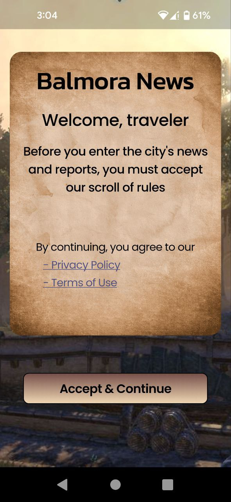
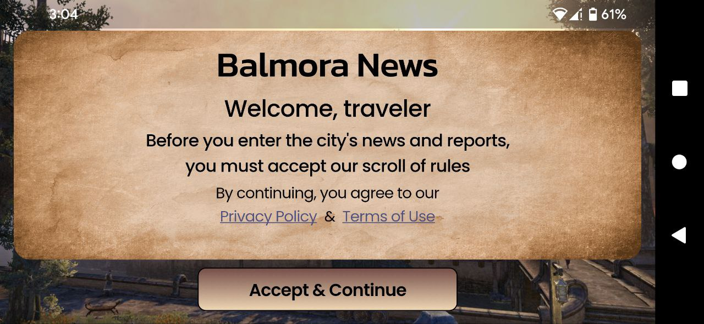
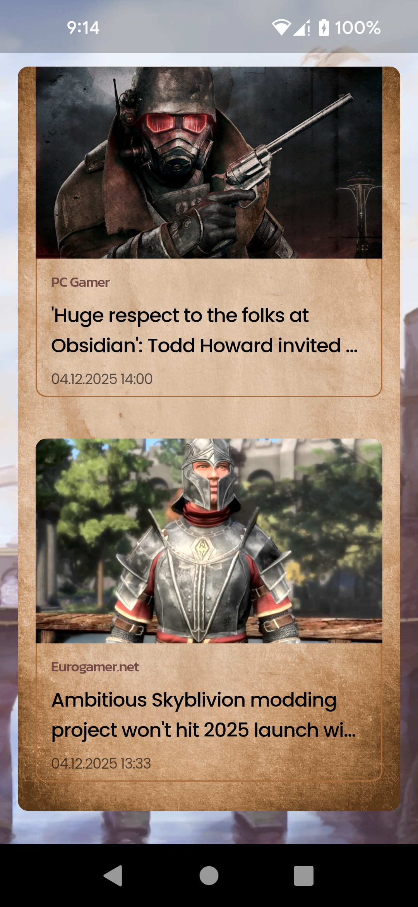
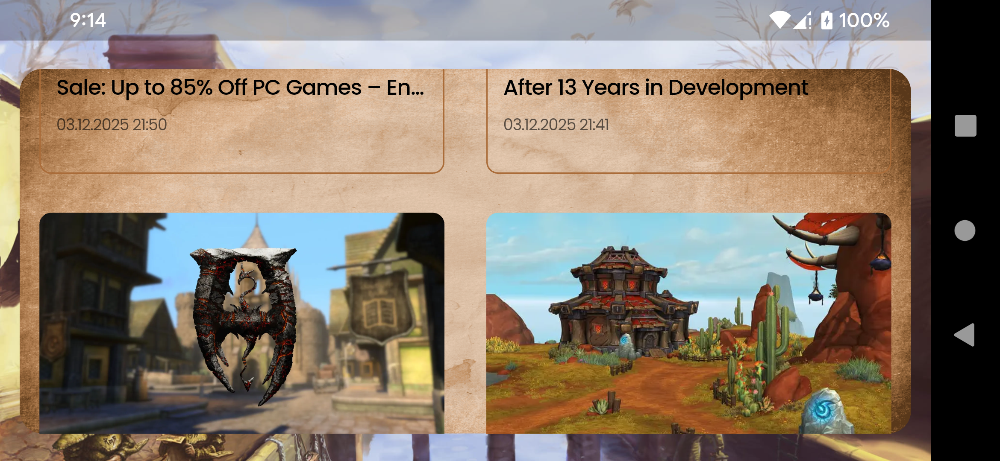
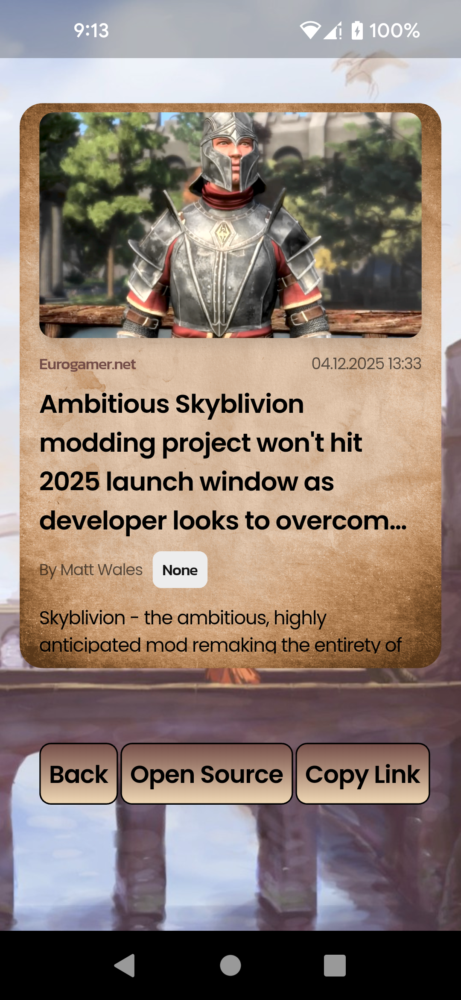
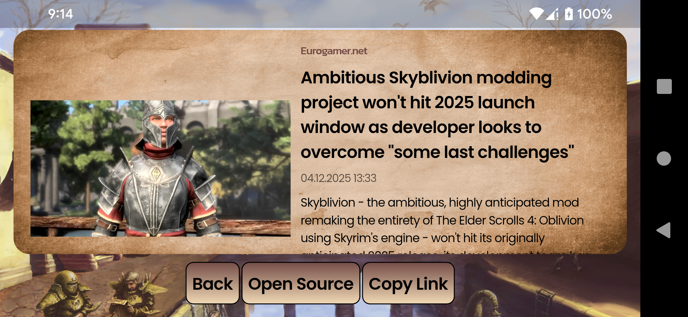

# balmoranews
Work In Progress

It could be done with the native flutter completely, but we have a requirement:
```YAML
Mandatory Technologies to use
- Bloc(https://pub.dev/packages/flutter_bloc) for state management (use Cubit)
- Dio (https://pub.dev/packages/dio) for services
- get_it for dependency injection (https://pub.dev/packages/get_it)
- JSON serializable (https://pub.dev/packages/json_serializable) for serializing
- Routing with Go router
```

First of all, GetIt is a ServiceLocator which is not context-based and is an anti-pattern. It's not DI.

Next. Since we are required to use flutter_bloc which depends on Provider
We can use connectivity_wrapper which is also depends on Provider, for less code over other approaches.

As it's not a real project, the .env and .build_template are not .gitignored

---

## Entry Screen




## News List

- Independent controller from UI variants, separated screen logic
- Initial load and retry
- Internet connection observer
- get new news OR get more older ones on scroll events
- hydrated bloc: mobile state offline cache and FlutterWeb bloc cache
- FPS ~59
- ability to change config of news request (NewsConfig)




## News Details

Shows all news details available, actions:
- open source link
- copy source link




# Struct Doc, generated by Llama
### 1. `lib/ui` - User Interface Implementation

This directory is responsible for the entire **User Interface (UI)** implementation, including all visual components and screen layouts.

| Subdirectory | Purpose |
| :--- | :--- |
| `common` | Contains shared UI components and assets, such as general-purpose widgets, text styles, and color definitions. |
| `mobile/portrait` | Specific UI implementations for **mobile devices** in **portrait** orientation. |
| `mobile/album` | Specific UI implementations for **mobile devices** in **landscape** (album) orientation. |
| `tablet/portrait` | Specific UI implementations for **tablet devices** in **portrait** orientation. |
| `tablet/album` | Specific UI implementations for **tablet devices** in **landscape** (album) orientation. |
| `desktop` | Specific UI implementations for **desktop** applications. |

### 2. `lib/core` - Orchestrator and Foundation

This directory acts as the **orchestrator** and foundation of the application. It holds global services and essential application-wide logic.

* **Core Components:**
    * `init`: Application initialization logic.
    * `di`: Service locator configuration (e.g., GetIt).
    * `routing`: Navigation and route management.
    * `core app`: The main application widget/setup.
* **Interface:**
    * `ResponsiveScreen`: An interface/abstract class that can be implemented in the `UI` layer to handle responsiveness.
    * `EncryptedLocalDatabaseModule`: A module that could be used by the `Data` layer for secure storage.
    * `ScreenModule (Locator -> Controller -> Screen)`: A foundational structure/module used by both the `UI` and `Logic` layers to wire up a screen's dependencies.

### 3. `lib/data` - Data Layer

This layer handles all **data-related operations**, including networking, local storage, and data modeling/conversion.

| Subdirectory | Purpose |
| :--- | :--- |
| `entity` | Deserialized data classes (models) and their conversion methods (e.g., from/to JSON, from/to database). |
| `services` | All external services, API clients, wrappers around third-party plugins (e.g., network clients, storage access). |

* **Key Responsibilities:**
    * Handling all **services** (API calls, database interactions).
    * **Wrappers** around connected plugins.
    * **Deserialized data classes** and their **conversions**.
    * Managing **isolates** and **download** processes.

### 4. `lib/logic` - Business Logic Layer

This layer contains the core **business logic** and state management for the application.

| Subdirectory | Purpose |
| :--- | :--- |
| `use_case` | Business logic operations that orchestrate interactions between the `Data` layer and the `Controller` sub layer. |
| `controller` | Non-screen-specific logic and background states (e.g., a `cubit` managing or app-wide settings that aren't pure services). |
| `screen_controller` | All the logic specific to a certain screen. This logic is then connected to different screen implementations in `UI` via the `ResponsiveScreen` in `Core`. |

* **Internal Logic Structure:**
    * The `lib/logic` directory may contain its own higher-level `entity` classes, for instance, specific data models for a screen's state, or `state/event` objects if the controller implements the BLoC pattern.